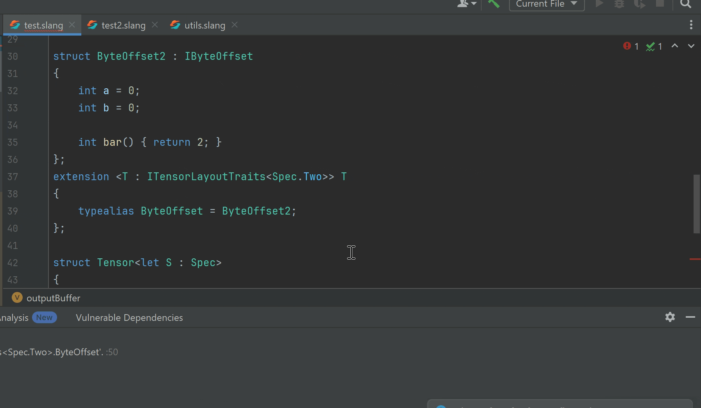

### This is an unofficial LSP for Slang to use with jetbrain IDEs.

---

### Example


---

### Jetbrains plugin distribution page
https://plugins.jetbrains.com/plugin/26239-slang-unofficial-

---

### To Build
1. install IntelliJ IDEA and JDK 21 or newer
2. fetch code with `git clone --recursive https://github.com/16-Bit-Dog/slang-intellj-extenson.git`
3. to use your installed IDEA, create `local.properties` with `localIdePath=/path/to/intellij-idea` and `compilerJavaHome=/path/to/intellij-idea/jbr` on separate lines. Otherwise, Gradle downloads IDEA 2024.1.4.
4. open the project in IDEA, select the Gradle wrapper and JDK 21 as the Gradle JVM, then run the `test` and `buildPlugin` tasks
5. install the plugin ZIP from `build/distributions/`

---

### If highlighting does not work, try the following:
(1) delete the Slang extension
(2) reinstall the Slang extension (latest version)

---

### To Run Tests
The project contains native Java tests to verify Lexer and Syntax Highlighter correctness. To run the tests, use the included Gradle wrapper (requires JDK 21):

**On Windows:**
```cmd
./gradlew test
```

**On macOS/Linux:**
```bash
./gradlew test
```
